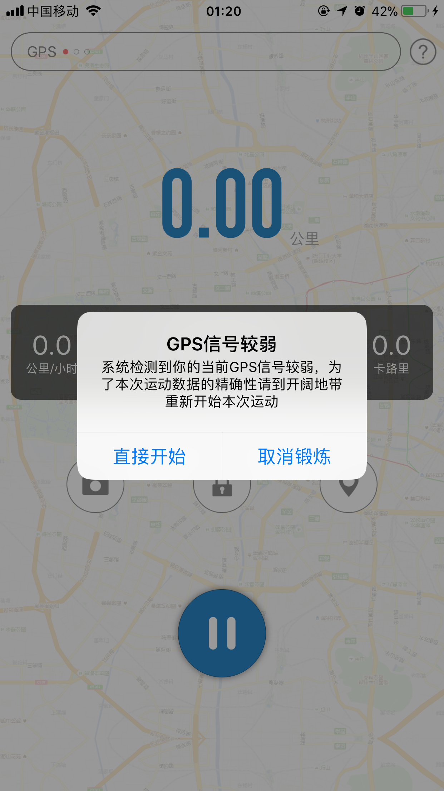
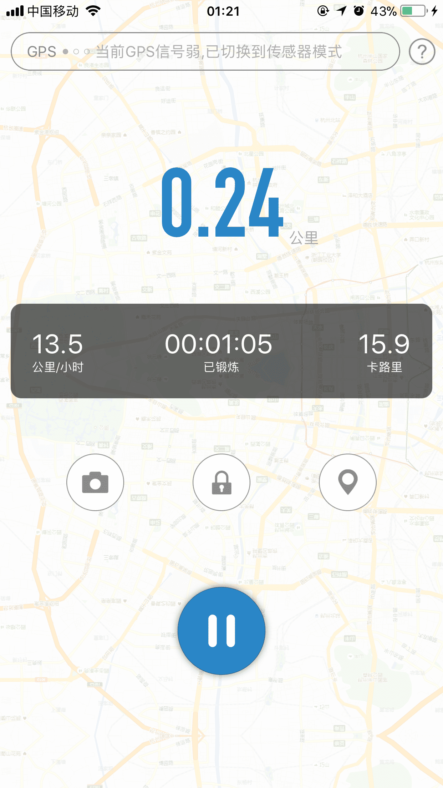
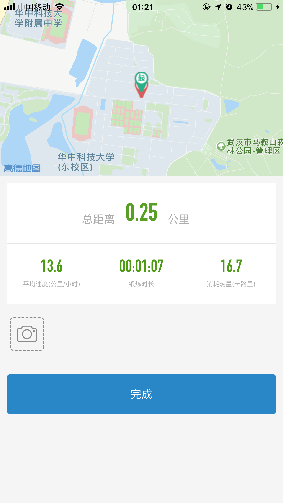
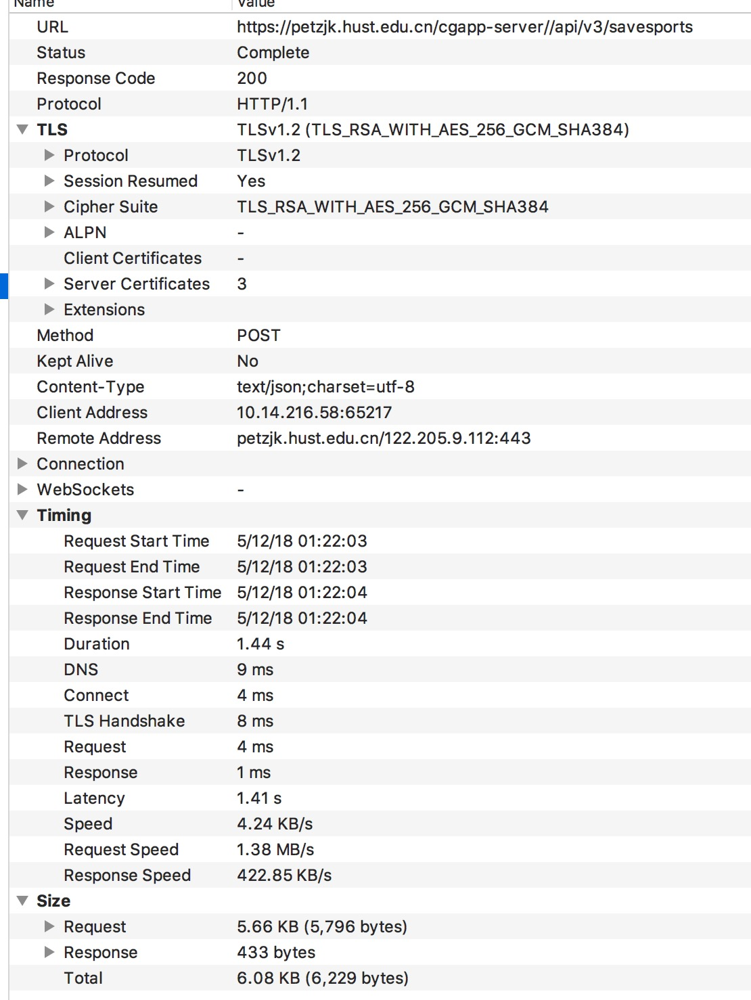
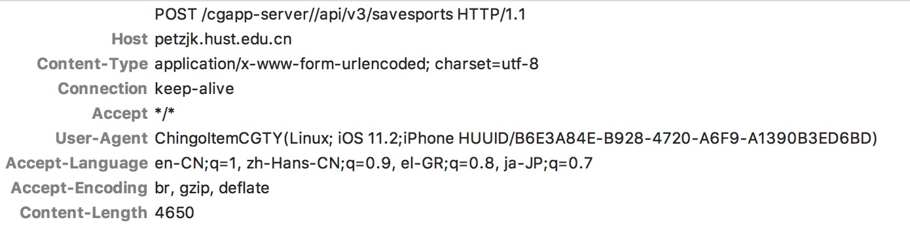
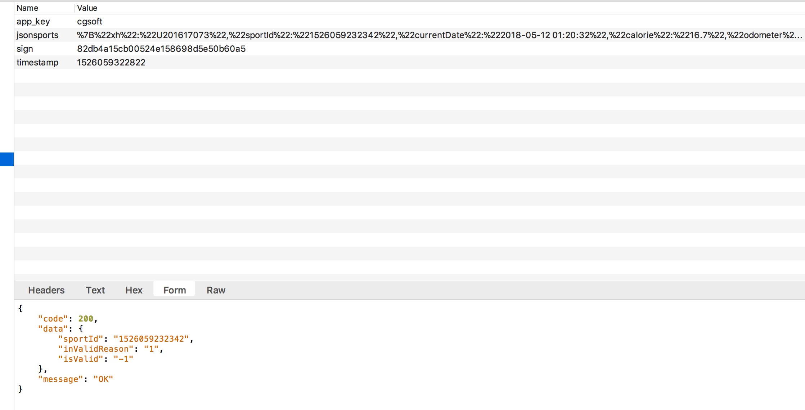

# 创高体育打卡脚本

[16级以后的自取](https://github.com/Letra312/chuanggao-checkIn)，没经历过体育打卡的老人就别凑热闹了:-)

## 使用方法

clone 仓库到本地之后，将config/congig.json中的XH值改成学号，将NAME值改成姓名

然后依次执行命令

```shell
cd <you-repository> # 进入clone下来的本地仓库
npm install # or yarn install
npm generate #生成本地 打卡成员列表
# 后续添加键入 npm input 可添加打卡成员功能
# 然后在config/participants.json中按照json格式把键改成自己名字，值改成学号即可
npm start # or yarn start
```

很久很久以前，就总是忘掉打卡，就想把创高体育给破了，这样子就可以不用跑步也能打卡啦:D **同时感谢lyt技术支持👏👏**

### 跑步

我们拿出手机，打开万恶的创高



运气还不错，刚好GPS信号不好

然后开始跑步（摇手机）



摇了一分钟，我们并不是要摇着打卡，只是想要发次请求而已，差不多了

结束跑步，打算提交，可以看到，我们的位置并未移动，还是跑了0.25公里



### 抓包

那么他到底发送了什么呢？我们抓包下来看一下





可以看到连headers都极其随意，甚至连cookie都没有！顿时信心满满

然后再看看详细的数据，那个jsonsports不就是一个urlencode吗，sign是个签名，timestamp是个时间戳（多次测试出app_key数据是不变的），好像也很简单呢，就想快点把他搞定了



url decode 之后的jsonSports数据结构如下：

``` json
{
    "xh": "U2016XXXXX",
    "sportId": "1525968995054",
    "currentDate": "2018-05-11 00:16:35",
    "calorie": "12.8",
    "odometer": "0.20",
    "avgSpeed": "12.6",
    "activeTime": "00:00:55",
    "mood": "0",
    "saySome": "",
    "beganPoint": "30.514429|114.434174",
    "endPoint": "30.514429|114.434174",
    "isValid": "1",
    "planRouteName": "跑步",
    "modementMode": "3",
    "routePolylineBh": "",
    "endTime": "2018-05-11 00:17:31",
    "beginTime": "2018-05-11 00:16:35",
    "routeId": "7",
    "phoneVersion": "iPhone8.2,11.2,B6E3A84E-B928-4720-A6F9-A1390B3ED6BD|3.4.2",
    "alreadyPassPoint": "",
    "name": "XXX",
    "stepCount": "0",
    "isValidReason": "",
    "coordinate": [{
        "a": "30.514084",
        "v": "1",
        "o": "114.434258",
        "s": "1526222274"
        }, {
        "a": "30.514027",
        "v": "-1",
        "o": "114.434265",
        "s": "1526222278"
        }, {
        "a": "30.513941",
        "v": "-1",
        "o": "114.434265",
        "s": "1526222281"
        }, {
        "a": "30.513897",
        "v": "-1",
        "o": "114.434265",
        "s": "1526222284"
        }, {
        "a": "30.513884",
        "v": "-1",
        "o": "114.434265",
        "s": "1526222287"
        }, {
        "a": "30.513874",
        "v": "-1",
        "o": "114.434250",
        "s": "1526222289"
        }, {
        "a": "30.513861",
        "v": "-1",
        "o": "114.434227",
        "s": "1526222292"
        }, {
        "a": "30.513844",
        "v": "-1",
        "o": "114.434204",
        "s": "1526222296"
        }, {
        "a": "30.513828",
        "v": "-1",
        "o": "114.434158",
        "s": "1526222299"
        }]
}
```

好像数据结构不是很复杂，但是那个sign是怎么获取的呢？

要知道怎么获取肯定需要反编译出源代码呀...

好吧，对加密算法一窍不通又不会安卓的我还是去求助吧...

第一次跟lyt说了这个玩意…安卓好像写的还蛮复杂，搞了一会…搞不定...

于是就鸽了三周，前不久终于搞出sign的加密方式了...

思路如下：

```javascript
const app_secret = '6d3121b650e42855976d0f70dd2048e4'; // 这是一个静态的字符串，不知道怎么获取的，也许是开发者女朋友的生日hash出来的吧hhh

function getSign(mapList, apiString, timestamp) {
  let toBeEncodedStr; // 要被加密的字符串
  let mapListStr = getmapListStr(mapList); // 由jsonsports键值拼接出来的字符串
  toBeEncodedStr =`${app_secret}${apiString}${mapListStr}${timestamp} ${app_secret}`; //可以很清楚的看到 被加密的字符串构成，即： app_secret + apiString('/api/v3/savesports') + 键值字符串 + ''(空格) + app_secret
  return md5Crypto(toBeEncodedStr); // 采用的是md5加密的方式
}
```

这样就简单了，还有一些小小细节的处理方式，那些有疑惑的需要都可以在源码里面解决啦~

## TODO

- 构建打卡UI

- 加入测试
- 提高本产品用户体验
- ...

持续更新...